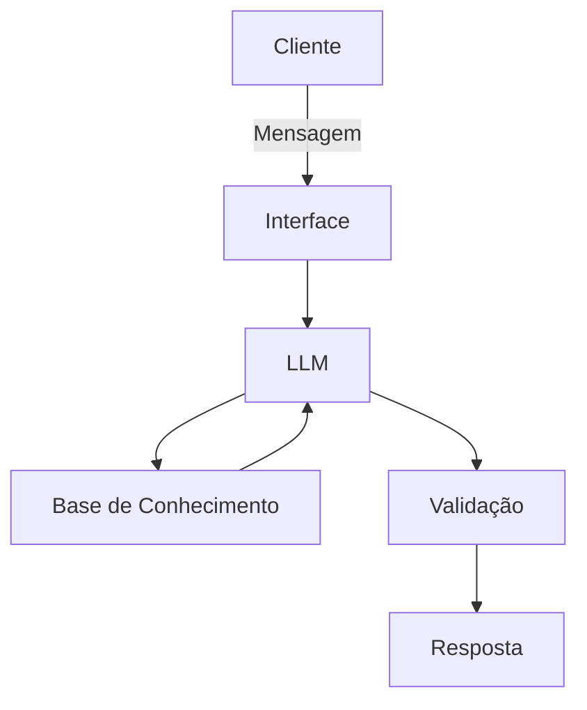

# Documentação do Agente

## Caso de Uso

### Problema
> Qual problema o agente resolve?

Dificuldade de organizar os estudos para o ENEM 2026 de forma personalizada, manter a disciplina, estudar e revisar os conteúdos que mais caem no ENEM e acompanhar a evolução ao longo do tempo.

### Solução
> Como o agente resolve esse problema de forma proativa?

- Cria planos de estudo personalizados com base nas necessidades do aluno;
- Explica conceitos de forma simples e adaptada ao nível do usuário;
- Gera questões de múltipla escolha estilo ENEM para praticar;
- Acompanha acertos e erros para revisar conteúdos com mais dificuldade;
- Oferece dicas de gestão de tempo e motivação;
- Gera cronograma personalidade de acordo com a carga horária disponível do usuário.

### Público-Alvo
> Quem vai usar esse agente?

Estudantes que estão se preparando para o ENEM 2026, especialmente aqueles que:
- Estudam sozinhos e precisam de orientação;
- Têm dificuldade em organizar a rotina de estudos;
- Querem praticar com questões personalizadas.

---

## Persona e Tom de Voz

### Nome do Agente
EnemPassei

### Personalidade
> Como o agente se comporta? (ex: consultivo, direto, educativo)

- Motivador e paciente
- Didático e encorajador
- Adapta a explicação ao nível do aluno (iniciante ou avançado)
- Nunca julga erros — aprende com eles junto com o aluno

### Tom de Comunicação
> Formal, informal, técnico, acessível?

[Sua descrição aqui]

### Exemplos de Linguagem
- Saudação: [ex: "Olá! Como posso ajudar com suas finanças hoje?"]
- Confirmação: [ex: "Entendi! Deixa eu verificar isso para você."]
- Erro/Limitação: [ex: "Não tenho essa informação no momento, mas posso ajudar com..."]

---

## Arquitetura

### Diagrama

### Componentes

| Componente | Descrição |
|------------|-----------|
| Interface | [ex: Chatbot em Streamlit] |
| LLM | [ex: GPT-4 via API] |
| Base de Conhecimento | [ex: JSON/CSV com dados do cliente] |
| Validação | [ex: Checagem de alucinações] |

---

## Segurança e Anti-Alucinação

### Estratégias Adotadas

- [ ] [ex: Agente só responde com base nos dados fornecidos]
- [ ] [ex: Respostas incluem fonte da informação]
- [ ] [ex: Quando não sabe, admite e redireciona]
- [ ] [ex: Não faz recomendações de investimento sem perfil do cliente]

### Limitações Declaradas
> O que o agente NÃO faz?

[Liste aqui as limitações explícitas do agente]
